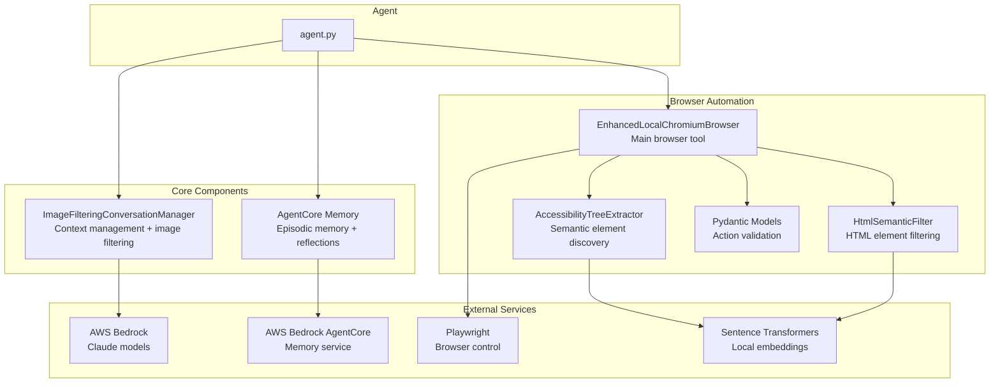
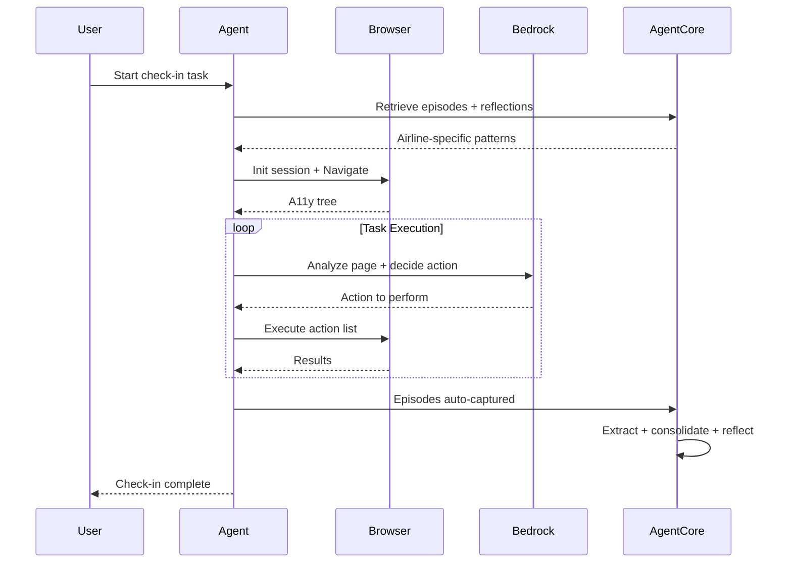
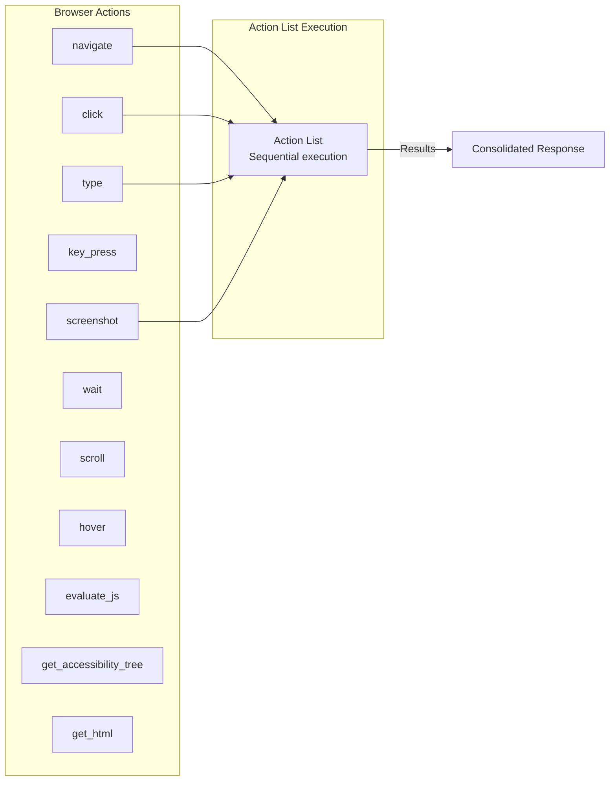
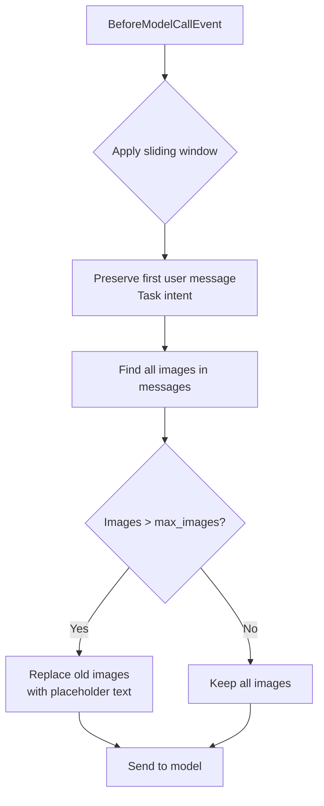
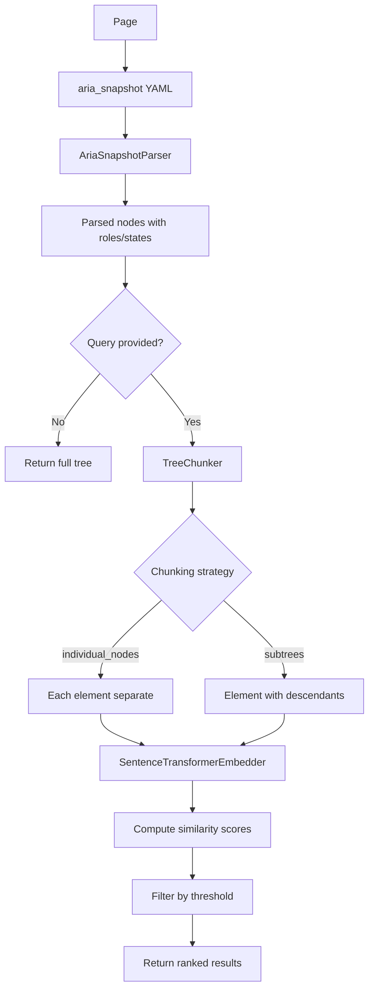

# Airline Check-In AI Agent

An intelligent browser automation agent for airline check-in workflows using [Strands Agents SDK](https://github.com/strands-agents/sdk-python) with AWS Bedrock and Playwright.

> **⚠️ Disclaimer:** 
AWS code samples are example code that demonstrates practical implementations of AWS services for specific use cases and scenarios.
These application solutions are not supported products in their own right, but educational examples to help our customers use our products for their applications. As our customer, any applications you integrate these examples into should be thoroughly tested, secured, and optimized according to your business's security standards & policies before deploying to production or handling production workloads.
## Overview

This project demonstrates an AI agent that autonomously completes airline check-in processes by:

- Analyzing web pages structurally (accessibility tree)
- Learning from execution patterns to improve over time
- Using semantic search to find interactive elements on pages

## Architecture



## Data Flow



## Project Structure

```
demo-airline/
├── src/
│   ├── agent.py                              # Main agent
│   ├── agentcore_server.py                   # AgentCore runtime server
│   ├── agentcore_memory.py                   # AgentCore memory integration
│   ├── config.py                             # Configuration from environment
│   ├── image_filtering_conversation_manager.py
│   └── enhanced_browser/
│       ├── __init__.py
│       ├── enhanced_browser.py               # Main browser tool
│       ├── accessibility_tree.py             # A11y extraction + semantic search + HTML filtering
│       └── models.py                         # Pydantic action models
├── scripts/
│   ├── create_agentcore_memory.py            # Setup/cleanup AgentCore memory (with rollback)
│   ├── explore_agentcore_memory.py           # Explore memory contents
│   └── store_cloudfront_secret.py            # Store CloudFront key in Secrets Manager
├── test-websites/
│   ├── deploy.sh                             # Deploy test websites to CloudFront
│   └── ...                                   # Static website content
├── screenshots/                              # Captured screenshots
├── deploy_agentcore.py                       # Deploy/cleanup AgentCore (with rollback)
├── invoke_agent.py                           # Invoke deployed agent
├── Dockerfile
├── pyproject.toml
└── README.md
```

## Key Components

### EnhancedLocalChromiumBrowser

The browser tool supports multiple action types that can be batched for efficiency:



**Key features:**

- **Batch actions**: Execute multiple actions in a single tool call
- **Coordinate clicking**: Click by (x, y) from screenshot analysis
- **Semantic filtering**: Find elements by meaning using local embeddings
- **State filtering**: Filter accessibility tree by ARIA states (e.g., `-disabled`)

### ImageFilteringConversationManager

Extends Strands' `SlidingWindowConversationManager` to aggressively reduce context size:



**Configuration:**

```python
conversation_manager = ImageFilteringConversationManager(
    window_size=8,      # Messages to keep
    max_images=2        # Screenshots to retain
)
```

### AgentCore Episodic Memory

AWS Bedrock AgentCore automatically captures and consolidates learnings across check-in sessions:

```mermaid
flowchart LR
    subgraph "During Execution"
        A[Agent executes actions] --> B[Conversation turns captured]
        B --> C[Episodes auto-extracted]
    end

    subgraph "Episode Processing"
        C --> D[Filter PII]
        D --> E[Extract airline patterns]
        E --> F[Store per airline namespace]
    end

    subgraph "Consolidation"
        F --> G[Periodic consolidation]
        G --> H[Generate reflections]
        H --> I[Update airline knowledge]
    end

    subgraph "Next Run"
        I --> J[Retrieve relevant episodes]
        J --> K[Inject into context]
    end
```



**Memory extraction rules (configured in `create_agentcore_memory.py`):**

- ✅ Extract: Airline-specific UI patterns, navigation flows, tool effectiveness, error solutions
- ❌ Filter: Passenger names, booking codes, flight details, payment info, all PII

### Accessibility Tree Extraction

Uses Playwright's `aria_snapshot()` with semantic filtering via sentence-transformers:



## Setup

### Prerequisites

- Python 3.11+
- uv package manager
- AWS credentials for Bedrock access

### Installation

```bash
# Install dependencies
uv sync

# Install Playwright browsers
uv run playwright install chromium
```

### Configuration

Create `.env` from the example:

```bash
cp .env.example .env
```

**Environment variables:**

| Variable | Default | Description |
|----------|---------|-------------|
| `MODEL_ID` | `claude-opus-4-5` | Bedrock model ID |
| `AWS_REGION` | `eu-west-1` | AWS region |
| `AIRLINE_URL` | Demo URL | Target check-in URL |
| `CHECK_IN_LOGIN` | `Smith` | Last name |
| `CHECK_IN_CODE` | `ABC123` | Confirmation code |
| `SEAT_PREFERENCE` | Row 10-14, aisle/window | Seat selection preference |
| `STRANDS_BROWSER_HEADLESS` | `true` | Run browser headless |
| `AGENTCORE_MEMORY_ID` | - | AgentCore memory ID (from setup script) |
| `AGENTCORE_MEMORY_ENABLED` | `true` | Enable AgentCore episodic memory |
| `CLOUDFRONT_KEY_PAIR_ID` | - | CloudFront public key ID (from CDK deployment) |
| `CLOUDFRONT_SECRET_NAME` | `airline-demo/cloudfront-private-key` | Secrets Manager secret name for private key |
| `CLOUDFRONT_PRIVATE_KEY` | - | Fallback: PEM file path or content (local dev only) |

## Usage

### CloudFront Signed Cookies (For Private Test Websites)

The test websites are deployed to private S3 buckets behind CloudFront with signed cookie authentication. This requires a one-time setup:

```bash
# 1. Deploy test websites (generates RSA key pair and deploys CDK stack)
cd test-websites && ./deploy.sh

# 2. Store private key in AWS Secrets Manager (for AgentCore deployment)
python scripts/store_cloudfront_secret.py --key-file ~/.cloudfront/airline-demo-key.pem

# 3. Add outputs to your .env files:
#    CLOUDFRONT_KEY_PAIR_ID=<from CDK output>
#    CLOUDFRONT_SECRET_NAME=airline-demo/cloudfront-private-key  # (default)
```

**How it works:**
- `deploy.sh` generates an RSA key pair at `~/.cloudfront/airline-demo-key.pem`
- The public key is registered with CloudFront during CDK deployment
- The private key signs cookies that grant browser access to private content
- AgentCore retrieves the private key from Secrets Manager at runtime

**Local development:** Set `CLOUDFRONT_PRIVATE_KEY` to the PEM file path instead of using Secrets Manager.

### Setup AgentCore Memory (One-time)

```bash
# Create episodic memory store (with automatic rollback on failure)
python scripts/create_agentcore_memory.py --region us-west-2

# Add the output AGENTCORE_MEMORY_ID to your .env files

# Recreate memory (delete existing first)
python scripts/create_agentcore_memory.py --force

# Clean up all memory resources (IAM role, memory store)
python scripts/create_agentcore_memory.py --clean
```

### Run Local Agent

Test the agent locally before containerizing.

#### 1. Start the test website server

```bash
# Start all test websites (ports 8001-8006)
cd test-websites && python serve.py

# Or start a single website
python test-websites/serve.py --site website1-skywest --port 8001
```

#### 2. Configure for visual debugging

Edit your `.env.websiteX` file to enable visible browser mode:

```bash
STRANDS_BROWSER_HEADLESS=false   # Show browser window for visual feedback
```

This lets you watch the agent navigate the check-in flow in real-time.

#### 3. Run the agent

```bash
# Run against a specific test website
uv run --env-file .env.website1 src/agent.py

# Run headless (no browser window) - faster, for CI/automated testing
STRANDS_BROWSER_HEADLESS=true uv run --env-file .env.website1 src/agent.py
```

**Environment files:**
- `.env.website1` through `.env.website6` - Pre-configured for each test airline website
- `.env` - Base configuration (copy from `.env.example`)

**Test websites:** See `test-websites/README.md` for details on each website's challenges and test credentials.

**Expected output:**
```
============================================================
AIRLINE CHECK-IN AGENT
============================================================
Target URL: http://localhost:8001/
AgentCore Memory: enabled
============================================================
Creating LocalChromiumBrowser (BROWSER_TYPE=local)
```

The agent will open a browser, navigate to the airline check-in page, and complete the check-in flow autonomously.

## AgentCore Deployment

The agent can be deployed to Amazon Bedrock AgentCore for serverless execution.

### Build Docker Image

```bash
docker build -t airline-agent:local .
```

### Local Testing

Docker Desktop on macOS runs containers in a Linux VM, which may have DNS resolution issues with corporate networks. Use `--dns 8.8.8.8` to bypass this:

```bash
# Get temporary AWS credentials
CREDS=$(aws sts get-session-token --output json)

# Run the container with credentials and DNS fix
docker run -p 8080:8080 --dns 8.8.8.8 \
  -e AWS_ACCESS_KEY_ID=$(echo $CREDS | jq -r '.Credentials.AccessKeyId') \
  -e AWS_SECRET_ACCESS_KEY=$(echo $CREDS | jq -r '.Credentials.SecretAccessKey') \
  -e AWS_SESSION_TOKEN=$(echo $CREDS | jq -r '.Credentials.SessionToken') \
  -e AWS_REGION=us-west-2 \
  -e AGENTCORE_MEMORY_ENABLED=false \
  airline-agent:local
```

**Alternative: Use assumed role credentials**
```bash
CREDS=$(aws sts assume-role --role-arn arn:aws:iam::ACCOUNT:role/ROLE_NAME --role-session-name docker-test --output json)

docker run -p 8080:8080 --dns 8.8.8.8 \
  -e AWS_ACCESS_KEY_ID=$(echo $CREDS | jq -r '.Credentials.AccessKeyId') \
  -e AWS_SECRET_ACCESS_KEY=$(echo $CREDS | jq -r '.Credentials.SecretAccessKey') \
  -e AWS_SESSION_TOKEN=$(echo $CREDS | jq -r '.Credentials.SessionToken') \
  -e AWS_REGION=us-west-2 \
  -e AGENTCORE_MEMORY_ENABLED=false \
  airline-agent:local
```

### Test Endpoints

```bash
# Health check
curl http://localhost:8080/ping

# Invoke with custom prompt
curl -X POST http://localhost:8080/invocations \
  -H "Content-Type: application/json" \
  -d '{"input": {"prompt": "Navigate to example.com and describe what you see"}}'

# Invoke with default check-in task (uses config values)
curl -X POST http://localhost:8080/invocations \
  -H "Content-Type: application/json" \
  -d '{"input": {"use_default_task": true}}'
```

### Deploy to AgentCore

**Important:** If using CloudFront-protected test websites, export the CloudFront credentials before deploying. These are passed to the AgentCore runtime as environment variables:

```bash
# Export CloudFront credentials (required for private test websites)
export CLOUDFRONT_KEY_PAIR_ID=<from CDK output: CloudFrontKeyPairId>
export CLOUDFRONT_SECRET_NAME=airline-demo/cloudfront-private-key

# Deploy (creates IAM role, ECR repo, builds/pushes image, creates AgentCore runtime)
# Includes automatic rollback on failure
AWS_REGION=us-west-2 python deploy_agentcore.py

# Clean up all deployed resources (agent runtime, ECR repo, IAM role)
# Note: AgentCore memory is preserved as it contains learned patterns
python deploy_agentcore.py --clean
```

**Rollback behavior:** If deployment fails, the script automatically cleans up resources created during that deployment attempt (in reverse order: agent runtime → ECR repo → IAM policy → IAM role).

**Update existing deployment:** If you deployed without CloudFront credentials, you can update the runtime:

```bash
aws bedrock-agentcore-control update-agent-runtime \
  --agent-runtime-id <runtime-id> \
  --environment-variables '{
    "CLOUDFRONT_KEY_PAIR_ID": "<key-pair-id>",
    "CLOUDFRONT_SECRET_NAME": "airline-demo/cloudfront-private-key"
  }'
```

### Invoke Deployed Agent

Use `invoke_agent.py` to call the deployed AgentCore runtime with streaming support:

```bash
# Basic invocation (builds prompt from .env file)
python invoke_agent.py --env .env.website1

# Custom prompt
python invoke_agent.py --env .env.website1 --prompt "Check in and select exit row seats"

# Specify agent ARN and session
python invoke_agent.py --env .env.website1 \
  --agent-arn arn:aws:bedrock-agentcore:us-west-2:ACCOUNT:agent-runtime/airline-checkin-agent \
  --session-id my-session-123
```

**Configuration:**
- Reads `AGENT_RUNTIME_ARN` from env file if `--agent-arn` not provided
- Automatically extracts airline ID from `AIRLINE_URL` for memory namespacing
- Uses `AGENTCORE_MEMORY_ID` for episodic memory if available
- Builds default prompt from `AIRLINE_URL`, `CHECK_IN_LOGIN`, `CHECK_IN_CODE`, `SEAT_PREFERENCE`

### Troubleshooting Local Docker

**DNS resolution fails** (`Name or service not known`):
- Use `--dns 8.8.8.8` to use Google's public DNS instead of corporate DNS

**Cannot connect to Bedrock API**:
- Ensure AWS credentials are passed via `-e` environment variables
- Verify credentials work: `aws sts get-caller-identity`

**Container starts but agent fails**:
- Check logs in the terminal running the container
- Verify `AWS_REGION` matches where you have Bedrock model access

## Browser Tool Examples

### Basic Navigation

```json
{"action": {"type": "navigate", "session_name": "check-in-session", "url": "https://..."}}
```

### Action List (Preferred)

```json
{"action": [
  {"type": "click", "session_name": "check-in-session", "x": 640, "y": 400},
  {"type": "screenshot", "session_name": "check-in-session"}
]}
```

### Semantic Element Discovery

```json
{"action": {"type": "get_accessibility_tree", "session_name": "check-in-session", "query": "submit button"}}
```

### State Filtering (Find Available Seats)

```json
{"action": {"type": "get_accessibility_tree", "session_name": "check-in-session", "filter_roles": ["button"], "filter_states": ["-disabled"]}}
```

### JavaScript Fallback

```json
{"action": {"type": "evaluate_js", "session_name": "check-in-session", "script": "document.querySelector('button.submit').click()"}}
```

## Performance Optimizations

1. **Action batching**: Combine multiple actions to reduce tool calls
2. **Image filtering**: Keep only last N screenshots in context
3. **System prompt caching**: Cache points for Bedrock prompt caching
4. **Tool caching**: Enable tool definition caching
5. **Embedding preloading**: Load sentence-transformer model at startup
6. **AgentCore memory**: Automatic episode extraction and reflection generation per airline

## Dependencies

- `strands-agents` - Agent framework
- `strands-agents-tools` - Browser automation tools
- `playwright` - Browser automation
- `boto3` - AWS SDK for Bedrock
- `bedrock-agentcore` - AgentCore memory integration
- `pydantic` - Input validation
- `nest-asyncio` - Async event loop support
- `PyYAML` - YAML parsing for accessibility tree
- `fastapi` / `uvicorn` - AgentCore server
- `aws-opentelemetry-distro` - Observability

## License

MIT-0
